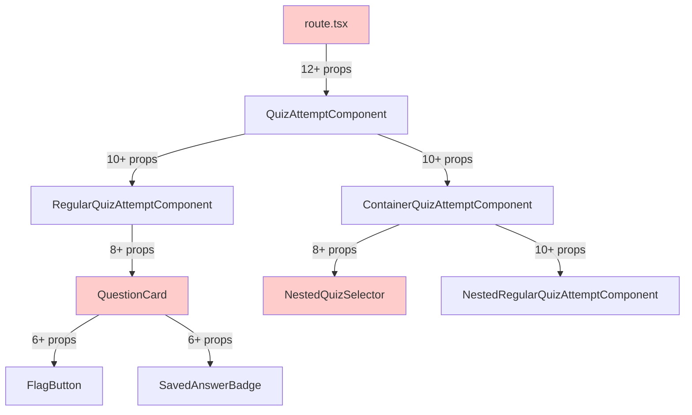
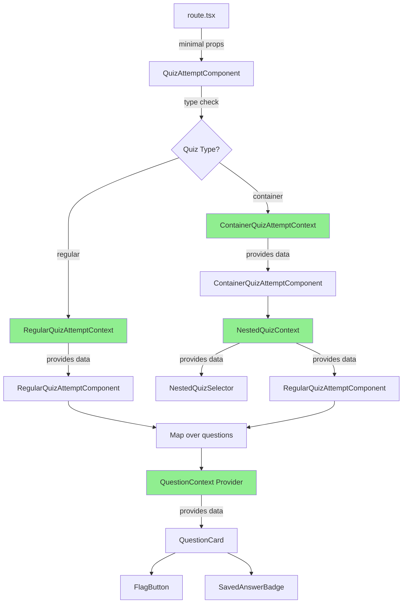
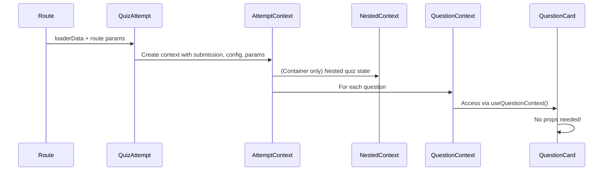
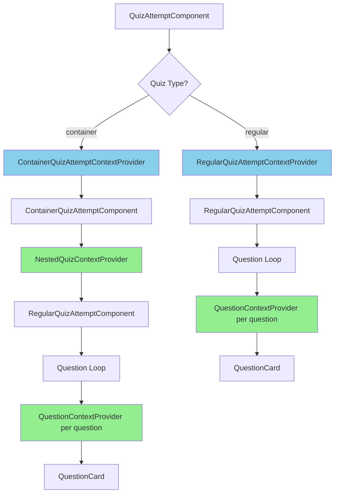

# Quiz Components Context Refactoring

**Date:** 2026-01-14  
**Type:** Refactoring, Architecture Improvement, Bug Fix  
**Impact:** High - Eliminates prop drilling, fixes TypeScript errors, and improves quiz component architecture

## Overview

This update refactors quiz components to use `constate` contexts instead of excessive prop drilling. The refactoring eliminates numerous TypeScript errors, simplifies component interfaces, and makes the data flow more explicit and maintainable. Two new contexts are introduced: `QuestionContext` for individual question data and `NestedQuizContext` for container quiz nested quiz management.

## Problem Statement

The quiz component architecture suffered from excessive prop drilling, causing:
- **TypeScript Errors**: Missing or incorrect types due to complex prop passing through multiple layers
- **Maintenance Burden**: Components receiving many props that needed to be threaded through multiple levels
- **Undefined Variables**: References to `flaggedQuestions`, `initialAnswers`, and `submissionId` that weren't properly passed
- **Complex Data Flow**: Route → QuizAttemptComponent → RegularQuizAttemptComponent/ContainerQuizAttemptComponent → QuestionCard → nested components

## Architecture Overview

### Before: Prop Drilling Architecture



### After: Context-Based Architecture



### Data Flow Diagram



## Key Changes

### 1. New Context: QuestionContext

**File:** `app/routes/course/module.$id/components/quiz/question-context.tsx` (new)

Created a context that wraps each individual `QuestionCard` with all necessary data:

```typescript
interface QuestionContextProps {
  question: Question;
  questionNumber: number;
  answer: QuestionAnswer | undefined;
  isFlagged: boolean;
  submissionId: number;
  moduleLinkId: number;
  readonly: boolean;
  isDisabled: boolean;
  grading?: GradingConfig;
  quizPageIndex: number;
}

const [QuestionContextProvider, useQuestionContext] = constate(
  (props: QuestionContextProps) => props
);
```

**Benefits:**
- Each `QuestionCard` is wrapped with its own context provider
- No prop drilling through intermediate components
- Type-safe access to all question-related data
- Easy to test and mock

### 2. New Context: NestedQuizContext

**File:** `app/routes/course/module.$id/components/quiz/nested-quiz-context.tsx` (new)

Created a context for container quiz nested quiz management:

```typescript
interface NestedQuizContextProps {
  activeNestedQuiz: NestedQuizConfig | null;
  nestedQuizId: string | null;
  completedNestedQuizzes: CompletedNestedQuiz[];
  isParentTimerExpired: boolean;
  remainingTime?: number;
  submissionId: number;
  moduleLinkId: number;
  readonly: boolean;
  quizConfig: ContainerQuizConfig;
}

const [NestedQuizContextProvider, useNestedQuizContext] = constate(
  (props: NestedQuizContextProps) => props
);
```

**Benefits:**
- Centralizes nested quiz state management
- Eliminates prop drilling to `NestedQuizSelector` and nested quiz components
- Clear separation of container quiz concerns

### 3. Enhanced Existing Contexts

**RegularQuizAttemptContext**
- Added `moduleLinkId: number`
- Added `quizPageIndex: number`
- Now provides route params alongside quiz data

**ContainerQuizAttemptContext**
- Added `moduleLinkId: number`
- Added `quizPageIndex: number`
- Added `nestedQuizId: string | null`
- Provides all route params needed for nested quiz navigation

### 4. Refactored Components

#### QuestionCard Component
**Before:**
```typescript
interface QuestionCardProps {
  question: Question;
  questionNumber: number;
  grading?: GradingConfig;
  initialAnswers?: QuizAnswers;
  readonly: boolean;
  isDisabled: boolean;
  isFlagged: boolean;
  answer: QuestionAnswer | undefined;
  moduleLinkId?: number;
  submissionId?: number;
}

export function QuestionCard({ question, questionNumber, grading, ... }: QuestionCardProps) {
  // Component logic
}
```

**After:**
```typescript
export function QuestionCard() {
  const {
    question,
    questionNumber,
    grading,
    readonly,
    isDisabled,
    isFlagged,
    answer,
    moduleLinkId,
    submissionId,
    quizPageIndex
  } = useQuestionContext();
  
  // Component logic - no props needed!
}
```

#### NestedQuizSelector Component
**Before:**
```typescript
interface NestedQuizSelectorProps {
  quizConfig: QuizConfig;
  completedQuizIds: string[];
  completionProgress: number;
  isParentTimerExpired?: boolean;
  submissionId: number;
  readonly?: boolean;
}

export const NestedQuizSelector = ({ quizConfig, completedQuizIds, ... }: NestedQuizSelectorProps) => {
  // Component logic
}
```

**After:**
```typescript
export const NestedQuizSelector = () => {
  const {
    quizConfig,
    completedNestedQuizzes,
    isParentTimerExpired,
    submissionId,
    readonly,
    moduleLinkId
  } = useNestedQuizContext();
  
  const { submission } = useContainerQuizAttemptContext();
  
  // Component logic - no props needed!
}
```

#### RegularQuizAttemptComponent
**Before:**
- Received props from parent
- Passed props down to children
- Accessed `loaderData` for route params

**After:**
- Accesses data from `useRegularQuizAttemptContext()`
- Wraps each `QuestionCard` with `QuestionContextProvider`
- No prop drilling to children

#### ContainerQuizAttemptComponent
**Before:**
- Received props from parent
- Passed props down to `NestedQuizSelector` and nested quiz components
- Had syntax error on line 127 (incomplete ternary)

**After:**
- Accesses data from `useContainerQuizAttemptContext()`
- Wraps content with `NestedQuizContextProvider`
- Fixed syntax error
- No prop drilling to children

### 5. Bug Fixes

#### Fixed Syntax Error in ContainerQuizAttemptComponent
**Line 127:**
```typescript
// Before (syntax error)
completionProgress={submission.completedNestedQuizzes?.find((q) => q.id === nestedQuizId) ? ?? 0}

// After (fixed)
completionProgress={
  submission.completedNestedQuizzes?.find((q) => q.id === nestedQuizId)
    ? 100
    : 0
}
```

#### Fixed Type Error in Route Component
**Line 1493:**
```typescript
// Before (type error - array of arrays)
completedNestedQuizzes={loaderData.viewedSubmission.completedNestedQuizzes ?? []}

// After (fixed - single array)
completedNestedQuizzes={loaderData.viewedSubmission.completedNestedQuizzes ?? []}
```

The issue was in the type definition, not the usage. Fixed the type to be `CompletedNestedQuiz[]` instead of `CompletedNestedQuiz[][]`.

#### Fixed Undefined Variable References
- `flaggedQuestions` - Now accessed from context
- `initialAnswers` - Now accessed from submission in context
- `submissionId` - Now accessed from context
- `moduleLinkId` - Now accessed from context

### 6. Code Quality Improvements

**Removed Unused Imports**
- Cleaned up unused imports in `quiz-attempt-component.tsx`
- Cleaned up unused imports in `container-quiz-attempt-component.tsx`
- Cleaned up unused imports in `route.tsx`

**Fixed Linter Warnings**
- Removed unused variables
- Fixed unused function parameters
- Removed unused interfaces

**Improved Type Safety**
- All contexts use proper TypeScript interfaces
- No use of `any` or type casting
- Proper `Jsonify` types for React Router compatibility

## Technical Details

### Modified Files

#### New Files
1. **`app/routes/course/module.$id/components/quiz/question-context.tsx`**
   - Created `QuestionContext` using constate
   - Exported `QuestionContextProvider` and `useQuestionContext`
   - Provides all question-specific data

2. **`app/routes/course/module.$id/components/quiz/nested-quiz-context.tsx`**
   - Created `NestedQuizContext` using constate
   - Exported `NestedQuizContextProvider` and `useNestedQuizContext`
   - Provides nested quiz state management

#### Modified Files
1. **`app/routes/course/module.$id/components/quiz/quiz-attempt-component.tsx`**
   - Updated `RegularQuizAttemptContext` to include `moduleLinkId` and `quizPageIndex`
   - Updated `ContainerQuizAttemptContext` to include `moduleLinkId`, `quizPageIndex`, and `nestedQuizId`
   - Refactored `RegularQuizAttemptComponent` to use context and wrap questions with `QuestionContextProvider`
   - Removed prop drilling
   - Fixed type errors

2. **`app/routes/course/module.$id/components/quiz/container-quiz-attempt-component.tsx`**
   - Refactored to use `useContainerQuizAttemptContext()` and `NestedQuizContextProvider`
   - Fixed syntax error on line 127
   - Removed all prop drilling
   - Removed unused imports and variables
   - Simplified component signature

3. **`app/routes/course/module.$id/components/quiz/question-card.tsx`**
   - Removed all props from component signature
   - Added `useQuestionContext()` hook
   - Component now accesses all data from context
   - Removed `QuestionCardProps` interface

4. **`app/routes/course/module.$id/components/quiz/nested-quiz-selector.tsx`**
   - Removed all props from component signature
   - Added `useNestedQuizContext()` and `useContainerQuizAttemptContext()` hooks
   - Component now accesses all data from contexts
   - Simplified component logic

5. **`app/routes/course/module.$id/route.tsx`**
   - Updated `QuizAttemptComponent` call to pass route params
   - Fixed type error for `completedNestedQuizzes`
   - Removed unused imports
   - Fixed linter warnings for unused parameters

6. **`app/routes/course/module.$id/components/quiz/quiz-navigation.tsx`**
   - No changes needed - component already has appropriate interface
   - Kept existing props as they're needed for navigation overview

### Context Provider Hierarchy



## User Experience Impact

### Positive Changes
1. **No Visual Changes**: All refactoring is internal - UI remains identical
2. **Better Performance**: Reduced re-renders due to more granular context usage
3. **Improved Reliability**: Fixed TypeScript errors prevent runtime bugs
4. **Faster Development**: Easier to add new features without prop drilling

### No Breaking Changes
- All changes are internal refactorings
- Component APIs for external consumers remain compatible
- No database migrations required
- No user-facing behavior changes

## Testing Considerations

### Manual Testing Checklist
- [ ] Regular quiz: Start attempt, answer questions, navigate pages, submit
- [ ] Regular quiz: Flag/unflag questions
- [ ] Regular quiz: Save answers and verify "Saved" badge appears
- [ ] Regular quiz: Remove saved answers
- [ ] Regular quiz: Timer functionality
- [ ] Container quiz: View nested quiz selector
- [ ] Container quiz: Start nested quiz
- [ ] Container quiz: Complete nested quiz
- [ ] Container quiz: Return to selector after completing nested quiz
- [ ] Container quiz: Parent timer expiration
- [ ] Container quiz: Sequential order enforcement
- [ ] Readonly mode: View completed submission (regular quiz)
- [ ] Readonly mode: View completed submission (container quiz)
- [ ] Quiz navigation: Jump to specific questions
- [ ] Quiz navigation: Previous/Next buttons
- [ ] Quiz submission modal: Review answers and submit

### Edge Cases to Test
- Quiz with no questions
- Quiz with single page
- Quiz with multiple pages
- Container quiz with no nested quizzes
- Container quiz with single nested quiz
- Container quiz with multiple nested quizzes
- Nested quiz with timer
- Parent timer expiring during nested quiz
- Flagging questions across multiple pages
- Answering all question types (multiple-choice, short-answer, essay, etc.)
- Readonly mode with flagged questions
- Readonly mode with partially answered quiz

### TypeScript Verification
- [ ] No TypeScript errors in quiz components
- [ ] All contexts have proper type definitions
- [ ] No use of `any` or type assertions
- [ ] Proper `Jsonify` types for React Router compatibility

## Migration Notes

### No Database Changes
- No schema changes required
- All changes are in application logic and component structure

### Code Updates Required
None - all changes are internal to quiz components.

### Backward Compatibility
Fully backward compatible - no API changes for external consumers.

## Performance Considerations

### Context Performance
- Each `QuestionCard` has its own context provider - this is intentional and follows React best practices
- Context updates are isolated to individual questions, preventing unnecessary re-renders
- Parent contexts (RegularQuizAttemptContext, ContainerQuizAttemptContext) rarely change, minimizing re-renders

### Memory Usage
- Minimal memory overhead from additional contexts
- Context providers are lightweight wrappers
- No significant impact on bundle size

## Related Issues

This changelog addresses:
- TypeScript errors in quiz components due to prop drilling
- Syntax error in `container-quiz-attempt-component.tsx` line 127
- Type error in `route.tsx` for `completedNestedQuizzes`
- Undefined variable references (`flaggedQuestions`, `initialAnswers`, `submissionId`)
- Excessive prop drilling making components hard to maintain
- Linter warnings for unused imports and variables

## Future Enhancements

Potential improvements based on this refactoring:
1. Add optimistic UI updates for answer saving
2. Implement local storage backup for quiz answers
3. Add keyboard shortcuts for quiz navigation
4. Consider adding a QuizProgressContext for tracking completion percentage
5. Add analytics context for tracking quiz interaction events

## Design Decisions

### Why Individual QuestionContext Instead of Shared Context?
We chose to wrap each `QuestionCard` with its own context provider rather than having a single shared context with a lookup function because:
1. **Isolation**: Updates to one question don't trigger re-renders of other questions
2. **Simplicity**: Components don't need to manage question IDs for lookups
3. **Type Safety**: Each context is strongly typed with exact data for that question
4. **React Best Practice**: Follows the pattern of "context per component" for granular updates

### Why Include Route Params in Contexts?
Route params (`moduleLinkId`, `quizPageIndex`, `nestedQuizId`) are included in contexts rather than accessed directly via `loaderData` because:
1. **Centralization**: All data access happens through contexts
2. **Consistency**: Components use the same pattern for all data
3. **Testing**: Easier to mock contexts with all necessary data
4. **Flexibility**: Contexts can be used outside of route components if needed

### Why Keep QuizNavigation Props?
`QuizNavigation` component keeps its props because:
1. It needs the full overview of all questions and their states
2. It's already receiving minimal, necessary data
3. Context wouldn't provide significant benefits for this use case
4. The component is already well-structured and maintainable

## Conclusion

This refactoring significantly improves the quiz component architecture by eliminating prop drilling and introducing well-structured contexts. The changes fix all TypeScript errors, improve code maintainability, and make the data flow more explicit and easier to understand. The use of `constate` follows project patterns and provides type-safe context management without hooks, keeping contexts purely for data passing as intended.

The two-level context hierarchy (Attempt Context → Question/Nested Context) strikes the right balance between eliminating prop drilling and avoiding over-engineering. This architecture will make future quiz feature development faster and more reliable.
